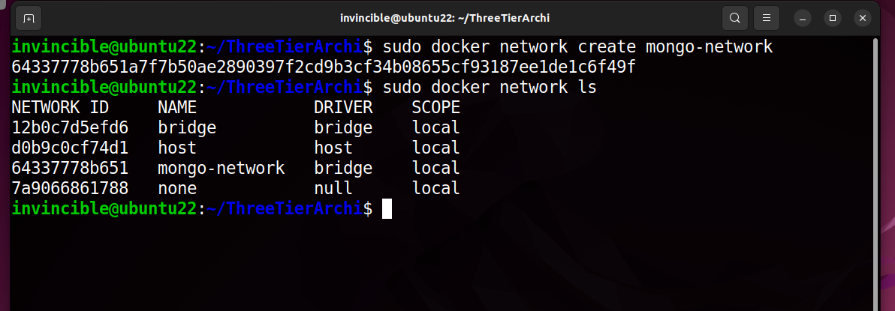
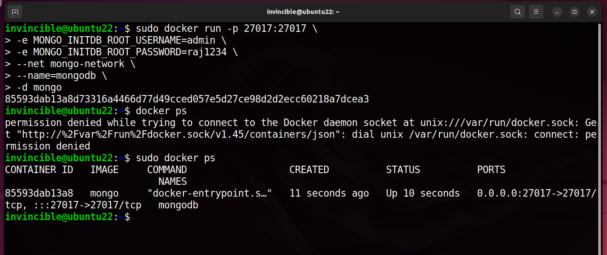
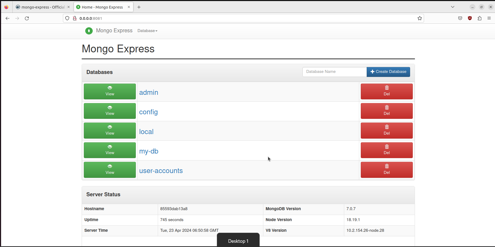
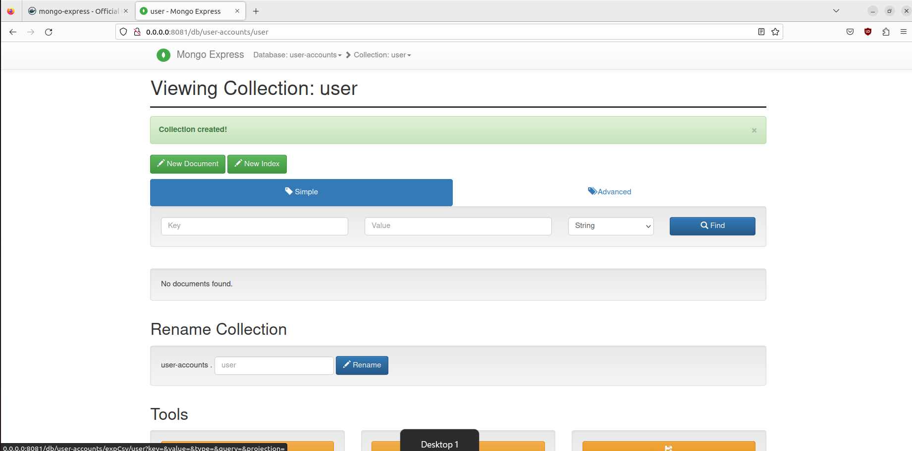
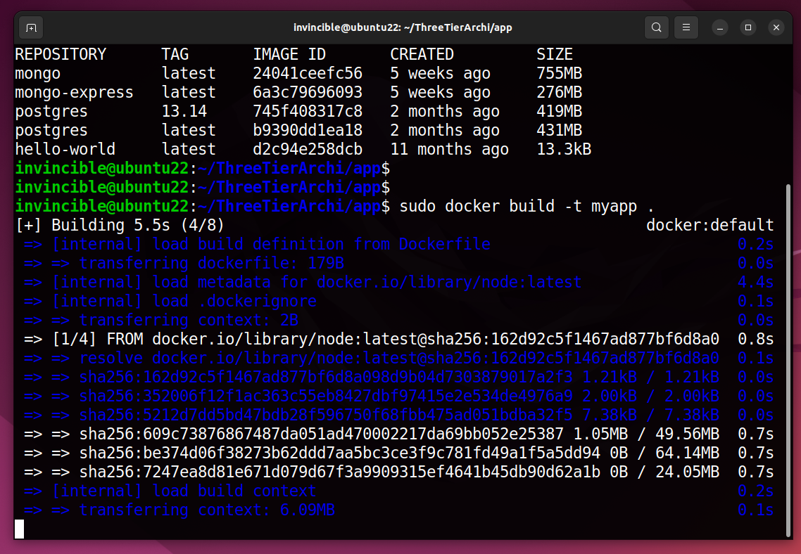
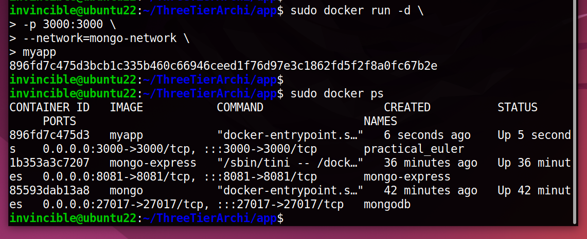
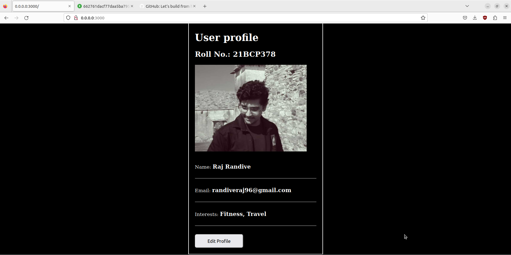
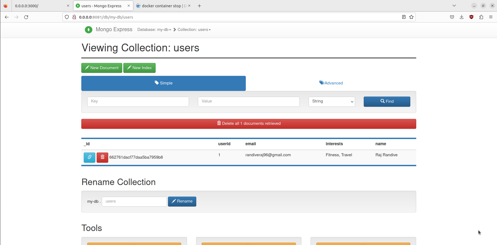

<!-- **bold**, _italic_, ~~strikethrough~~ or `keyword`. -->
<!-- [Link to another page](./another-page.html). -->

# **3-Tier Architecture Application Developing using Docker**

Follow my GitHub Account: [Raj Randive](https://github.com/Raj-Randive)

## Prerequisites

---

- System: Ubuntu 22.04.4 LTS (Jammy Jellyfish)
- Install "Docker" on your machine. For installing Docker, visit: [Official Documentation](https://docs.docker.com/engine/install/ubuntu/)

## Overview:

---

My project implements a 3-tier architecture using Docker containers. The architecture consists of:

- Sample-App container: Hosts the application logic.
- mongo-express container: Provides a user-friendly interface for MongoDB.
- MongoDB container: Houses the database.

This app shows a simple user profile app set up using

1. index.html with pure js and css styles
2. nodejs backend with express module
3. mongodb for data storage

<div style="text-align: justify">

This modular setup enables independent scaling, ensures consistent deployment across environments, and simplifies maintenance tasks, laying a solid foundation for scalable and efficient application deployment.

</div>

## Step 1. Create a docker network for container isolation.

```js
// Docker Command
docker network create <network-name>
```


## Step 2. Check if the network is created correctly.

```js
// Docker Command
docker network ls
```



## Step 3. Create "mongodb" container using following command

```js
// Docker Command
docker run -p 27017:27017 -e MONGO_INIT_ROOT_USERNAME=admin -e MONGO_INIT_ROOT_USERNAME=password --net mongo-network --name=mongodb -d mongo
```

- 27017 is by default port for mongodb container (refer mongodb DockerHub repository for more details).
- -e flag is for environment variables.
- We are spinning the container inside our mongo-network.
- Select the image "mongo". If no tag is passed, by default it takes latest tag.
- Check the spinned container "via docker ps" command.



## Step 4. Create "mongo-express" container which is used to manage the mongo database using following command.

```js
// Docker Command
docker run -p 8081:8081 -e ME_CONFIG_MONGODB_ADMINUSERNAME=admin -e ME_CONFIG_MONGODB_ADMINPASSWORD=password -e ME_CONFIG_MONGODB_SERVER=mongodb --network=mongo-network --name=mongo-express -d mongo-express
```

- 8081 is by default port for mongo-express container (refer mongo-express DockerHub repository for more details).
- -e flag is for environment variables.
- We are spinning the container inside our mongo-network.
- Refer DockerHub mongo-express Repository to get all the necessary environment variables.
- Select the image "mongo-express". If no tag is passed, by default it takes latest tag.
- Check the spinned container via "docker ps" command.


## Step 5. Open http://localhost:8081 and create two databases for our Sample-App.



## Step 6. Create a "user" collection inside our user-accounts database for our Sample-App which we are going to run soon.



## Step 7. Now clone the Sample-App on to your system and change the directory to app.

- You can clone the Sample-App from here: [Github Link - Raj Randive](https://github.com/Raj-Randive/3-Tier-Architecture-Docker).


## Step 8. Create a Dockerfile for our Sample-App

```js
// Docker Command
From node
WORKDIR /app
COPY . .
ENV MONGO_DB_USERNAME=admin
ENV MONGO_DB_PWD=password
RUN npm install
EXPOSE 3000
CMD ["node", "server.js"]
```

- We are using "node" image.
- Initialize the working directory as "/app" or give any other working dir.
- Give the environment variables i.e., username and passwords for our App to run.
- Open port 3000 as mentioned in our Sample-App.
- At last Run "node server.js" using CMD option.


## Step 9. Change the admin and password you gave earlier in the "server.js" file.


## Step 10. Check for the already created Images using following command.

```js
// Docker Command
docker images
```


## Step 11. Create the image for our Sample-App using the docker build command.

```js
// Docker Command
docker build -t <our-sample-app-name> .
```

- "-t" is for tagging our Sample-App image.
- We have added "." at the end because our dockerfile is in current directory where we are standing right now i.e., inside app folder.



## Step 12. Confirm the created image using following command.

```js
// Docker Command
docker images
```


## Step 13. Now create a container out of the Sample-App Image using following command.

```js
// Docker Command
docker run -d -p 3000:3000 --network=mongo-network <sample-app-name>
```

- "-d" is to spin the container in detached mode.
- Check the running container using "docker ps" command.
- We can see now we have 3 containers running.
  - First: Our Sample-App running.
  - Second: mongo-express container.
  - Third: mongodb container (database).



## Step 14. Open http://locahost:3000 to see our Sample-App home page.

- Click "Edit Profile" button and update the details. It will save the information on to our database.


## Step 15. After updating the details.



## Step 16. Go to our "users" collection to verify our data.



## Step 17. Click on the "userid" to see more detailed info about that user.


<!--  -->
<!--  -->

---

<br/>

### **Key Features and Benefits:**

<div style="text-align: justify">

Modularity: Each tier of our architecture is encapsulated within its own Docker container, allowing for independent scaling and management.

</div>

<div style="text-align: justify">

Scalability: With Docker's orchestration tools like Docker Swarm or Kubernetes, scaling our application horizontally becomes seamless and efficient.

</div>

<div style="text-align: justify">

Portability: Docker containers are highly portable, enabling consistent deployment across different environments, from development to production.

</div>

<div style="text-align: justify">

Ease of Management: Docker's containerization simplifies deployment, configuration, and maintenance tasks, reducing overhead and enhancing operational efficiency.

</div>

<div style="text-align: justify">

Flexibility: By decoupling the application logic, database, and user interface into separate tiers, our architecture offers flexibility for future enhancements and modifications.

</div>

<!--  -->
<br/>

### **Conclusion**:

<div style="text-align: justify">

By adopting a 3-tier architecture with Docker, we've created a scalable and resilient foundation for deploying modern applications. Whether you're building a small-scale prototype or a large-scale production system, leveraging containerization can streamline your development and deployment workflows, empowering you to focus on delivering value to your users.

</div>

<br/>

---

### Name: Raj Randive (21BCP378)

_Written on April 23, 2024_
