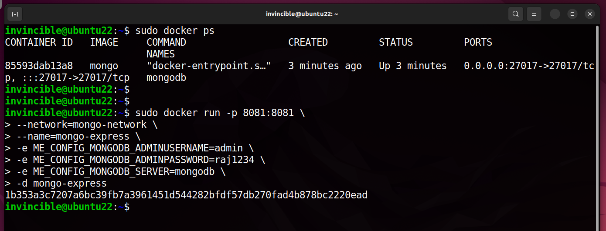
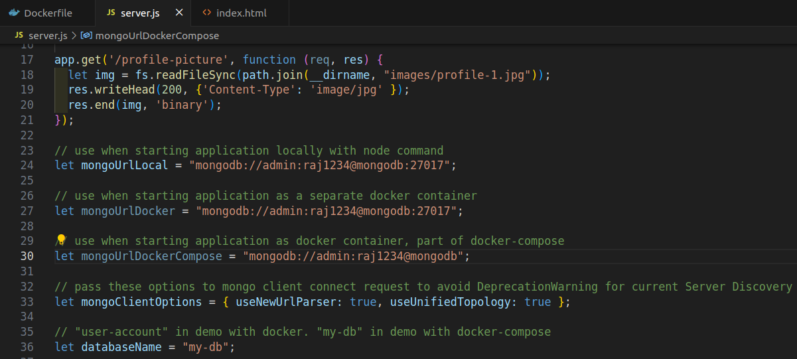
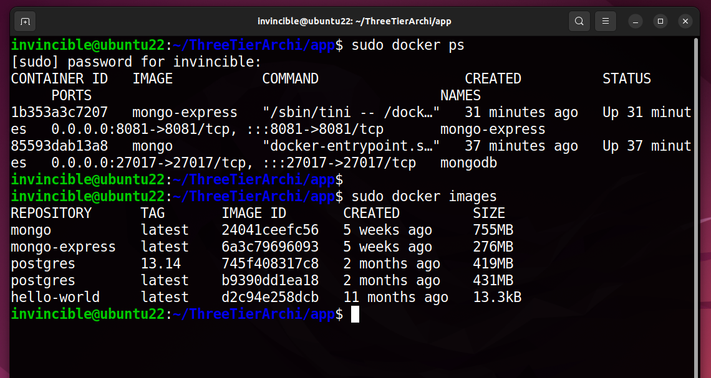
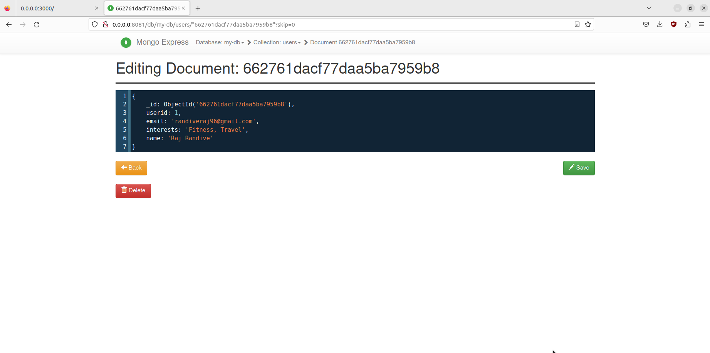

<!-- **bold**, _italic_, ~~strikethrough~~ or `keyword`. -->
<!-- [Link to another page](./another-page.html). -->

**3-Tier Architecture - Developing with Docker created by (21BCP378)**

This app shows a simple user profile app set up using

1. index.html with pure js and css styles
2. nodejs backend with express module
3. mongodb for data storage

All components are docker-based

<!-- # Header 1 -->

## Step 1. First of all create a docker network named "mongo-network" (in-my-case)

```js
// Docker Command
docker network create <network-name>
```


## Step 2. Check if the network is created correctly.

```js
// Docker Command
docker network ls
```


## Step 3. create "mongodb" container using following command

```js
// Docker Command
docker run -p 27017:27017 -e MONGO_INIT_ROOT_USERNAME=admin -e MONGO_INIT_ROOT_USERNAME=password --net mongo-network --name=mongodb -d mongo
```

- 27017 is by default port for mongodb container (refer mongodb DockerHub repository for more details).
- -e flag here means environment variables.
- We are spinning this container inside our mongo-network which we created earlier.
- At last give the image name "mongo". If no tag is passed, by default it takes latest tag.
- Check the spinned container via docker ps command.


## Step 4. create "mongo-express" container which is used to manage the mongo database using following command.

```js
// Docker Command
docker run -p 8081:8081 -e ME_CONFIG_MONGODB_ADMINUSERNAME=admin -e ME_CONFIG_MONGODB_ADMINPASSWORD=password -e ME_CONFIG_MONGODB_SERVER=mongodb --network=mongo-network --name=mongo-express -d mongo-express
```

- 8081 is by default port for mongo-express container (refer mongo-express DockerHub repository for more details).
- -e flag here means environment variables.
- We are spinning this container inside our mongo-network which we created earlier.
- Refer DockerHub mongo-express Repository to get all the necessary environment variables.
- At last give the image name "mongo". If no tag is passed, by default it takes latest tag.
- Check the spinned container via docker ps command.



## Step 5. Open http://localhost:8081 and create two databases for our sample app.


## Step 6. Create a "user" collection inside our user-accounts database for our sample app which we are goning to run soon.


## Step 7. Now clone the Sample-App on to your system and change the directory to app.

- You can clone the Sample-App from here: [Github Link - Raj Randive](https://github.com/Raj-Randive/3-Tier-Architecture-Docker).


## Step 8. Create a Dockerfile for our Sample-App

```js
// Docker Command
From node
WORKDIR /app
COPY . .
ENV MONGO_DB_USERNAME=admin
ENV MONGO_DB_PWD=password
RUN npm install
EXPOSE 3000
CMD ["node", "server.js"]
```

- We are using "node" image.
- Initialize the working directory as "/app" or give any other working dir.
- Give the environment variables i.e., username and passwords for our App to run.
- Open port 3000 as mentioned in our Sample-App.
- At last Run "node server.js" using CMD option.


## Step 9. Change the admin and password you gave earlier in the "server.js" file.



## Step 10. Check for the already created Images using following command.

```js
// Docker Command
docker images
```



## Step 11. Create the image for our Sample-App using the docker build command.

```js
// Docker Command
docker build -t <our-sample-app-name> .
```

- Here -t is for tagging our Sample-App image.
- We have added "." at the end because our dockerfile is in current directory where we are standing right now i.e., inside app folder.


## Step 12. Confirm the created image using following command.

```js
// Docker Command
docker images
```


## Step 13. Now create a container out of the Sample-App Image using following command.

```js
// Docker Command
docker run -d -p 3000:3000 --network=mongo-network <sample-app-name>
```

- "-d" is to spin the container in detached mode.
- Check the running container using "docker ps" command.
- We can see now we have 3 containers running.
  - First: Our Sample-App running.
  - Second: mongo-express container.
  - Third: mongodb container (database).


## Step 14. Open http://locahost:3000 to see our Sample-App home page.

- Click "Edit the Profile" button and update the deatils. It will save the information on to our database.


## Step 15. After updating the deatils.


## Step 16. Go to our "users" collection to see the data.


## Step 17. Click on the "userid" to see deatils.



> This is a blockquote following a header.
>
> When something is important enough, you do it even if the odds are not in your favor.

### This is how one can setup a 3-Tier Architecture using dockers.

#### Header 4

- This is an unordered list following a header.
- This is an unordered list following a header.
- This is an unordered list following a header.

##### Header 5

1.  This is an ordered list following a header.
2.  This is an ordered list following a header.
3.  This is an ordered list following a header.

###### Header 6

| head1        | head two          | three |
| :----------- | :---------------- | :---- |
| ok           | good swedish fish | nice  |
| out of stock | good and plenty   | nice  |
| ok           | good `oreos`      | hmm   |
| ok           | good `zoute` drop | yumm  |

### There's a horizontal rule below this.

---

### Here is an unordered list:

- Item foo
- Item bar
- Item baz
- Item zip

### And an ordered list:

1.  Item one
1.  Item two
1.  Item three
1.  Item four

### And a nested list:

- level 1 item
  - level 2 item
  - level 2 item
    - level 3 item
    - level 3 item
- level 1 item
  - level 2 item
  - level 2 item
  - level 2 item
- level 1 item
  - level 2 item
  - level 2 item
- level 1 item

### Small image

### Large image


### Definition lists can be used with HTML syntax.

<dl>
<dt>Name</dt>
<dd>Godzilla</dd>
<dt>Born</dt>
<dd>1952</dd>
<dt>Birthplace</dt>
<dd>Japan</dd>
<dt>Color</dt>
<dd>Green</dd>
</dl>

```
Long, single-line code blocks should not wrap. They should horizontally scroll if they are too long. This line should be long enough to demonstrate this.
```

```
The final element.
```
